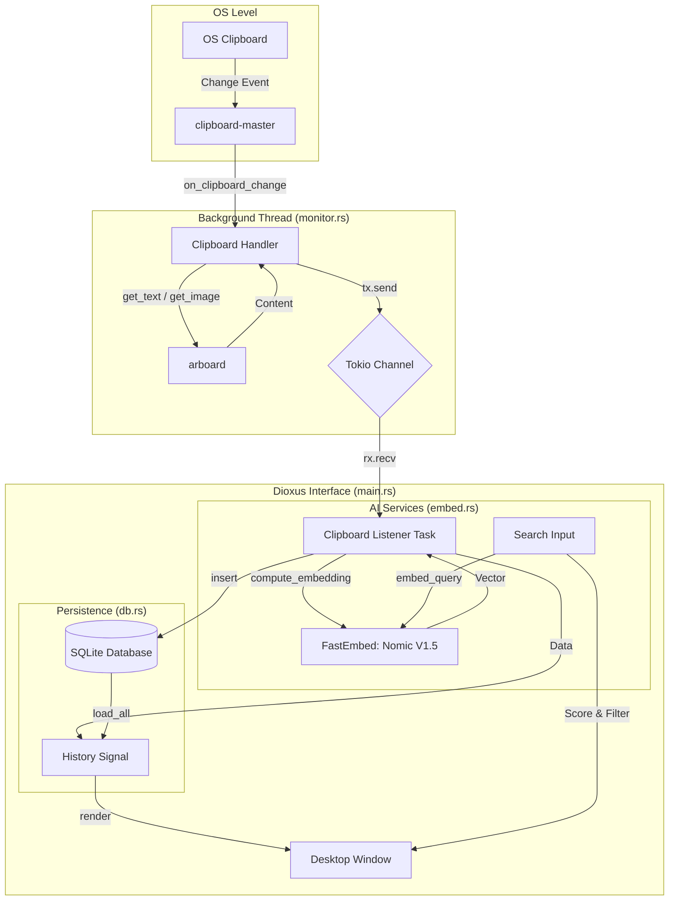

# shadowpaste 🌑

**shadowpaste** is a modern, AI-powered, high-performance clipboard manager for Windows built with **Rust** and **Dioxus**. It runs silently in the background, capturing your clipboard history and making it instantly searchable using local AI embeddings.

## ✨ Features

*   **⚡ Zero-Latency Capture:** Uses native Windows hooks (`WM_CLIPBOARDUPDATE`) for instant capture with near-zero CPU usage.
*   **🧠 Local AI Brain:** Embeds your clipboard content using `fastembed-rs` to allow semantic searching (e.g., search "recipe" to find a link to a cooking blog).
*   **🔒 Privacy First:** All clipboard history and AI vectors are stored locally in a SQLite database at `%LOCALAPPDATA%\shadowpaste\shadowpaste.db`.
*   **🪄 Hybrid Search:** Combines keyword search with vector embedding semantic search to provide the best of both worlds.
*   **🎨 Modern UI:** Built with Dioxus (React-like Rust) and Tailwind CSS for a sleek, dark-mode experience.

## 🛠️ Architecture

shadowpaste uses a multithreaded architecture to ensure the UI never freezes, even when processing heavy AI tasks.



## 🚀 Getting Started

### Prerequisites
*   [Rust & Cargo](https://rustup.rs/)
*   [Dioxus CLI](https://dioxuslabs.com/learn/0.4/getting_started/cli) (`cargo install dioxus-cli`)

### Running

1.  **Clone the repository**
    ```bash
    git clone https://github.com/jeffmagma/shadowpaste.git
    cd shadowpaste
    ```

2.  **Run the Development Server**
    ```bash
    dx serve
    ```

3.  **Build for Release**
    ```bash
    dx build --release --platform desktop
    ```

## 🗺️ Roadmap
- [ ] Sensitive data/password handling
- [ ] Global hotkey to open the app
- [ ] History pinning/favoriting